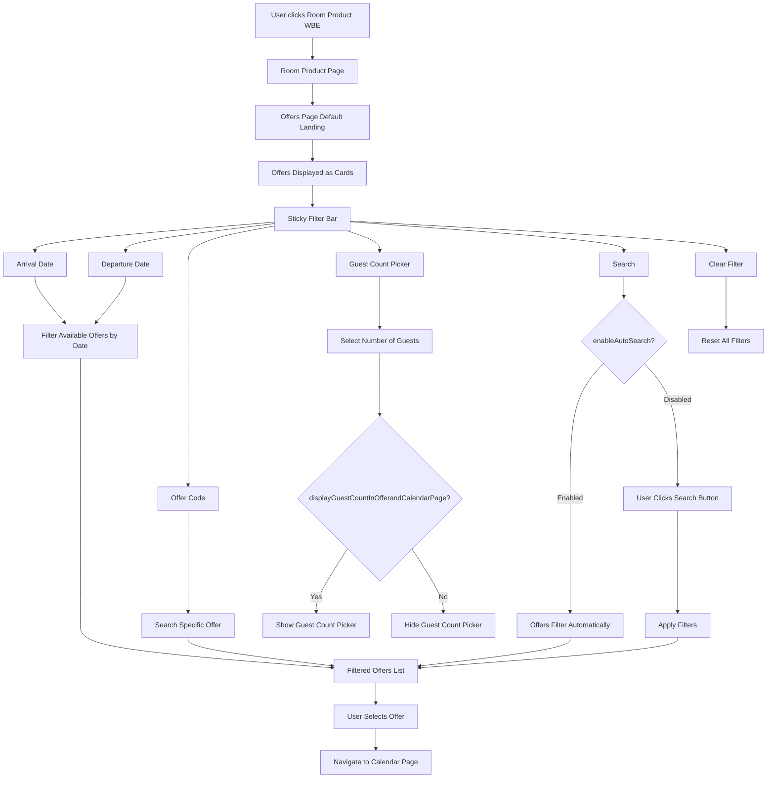

## Room Routes
## Room Flow - Offers

1. User clicks the Product as Room(WBE).
2. In Rooms have multiple sub items -> Offers, Calendar, Rooms and Rates
2. Landing into the Room Product Page By Default land into offers page.
3. Offer Page shows the list of offers as card view with select button and as in top sticky show the filter bar, it helps to filter out the offers based on filter value.
4. In the Filter contains Arrival and Departure Date, Offer Code Filter, Guest count picker, Search action, clear filter what it do.
5. In the date filter, when apply the dates, its show that date available offers.
6. In the offer code search, we can search a offer.
7. This lets the user choose how many guests are included in the offer search, It only appears when the property permission displayGuestCountInOfferandCalendarPage
8. Search action works based on auto search is on -> when user search the value automatically filter if its off user must click the search button to apply filter values. it will appears based on enableAutoSearch permissions.
9. when user selects the offer will navigate to calendar page.

