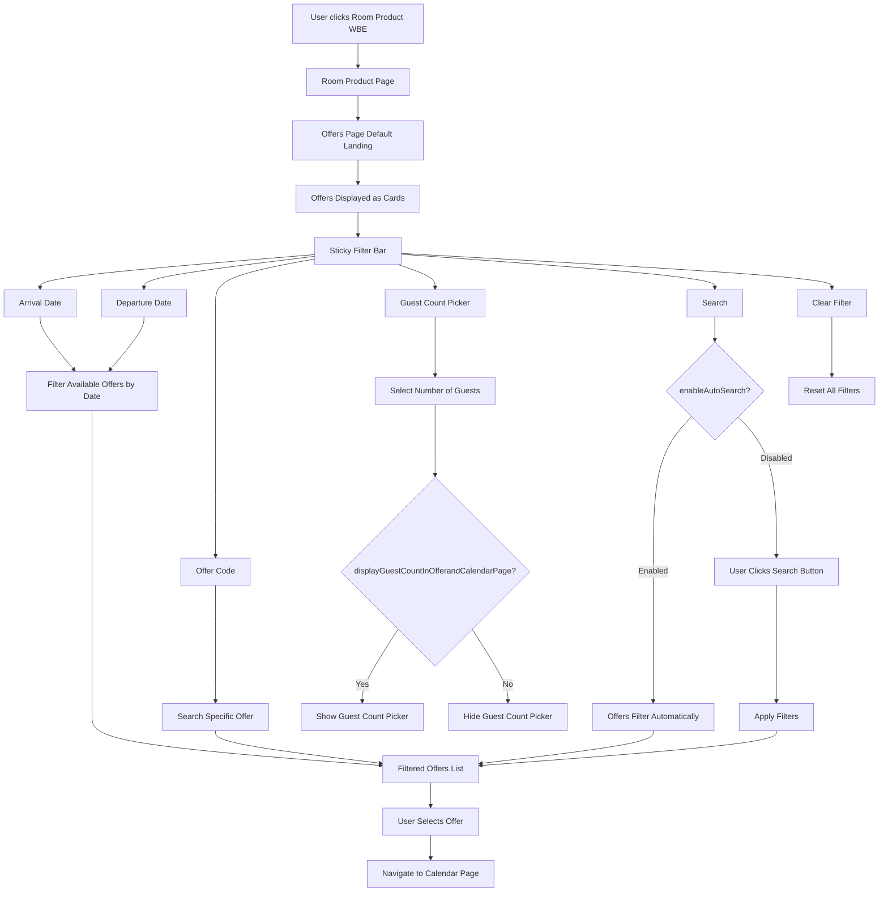
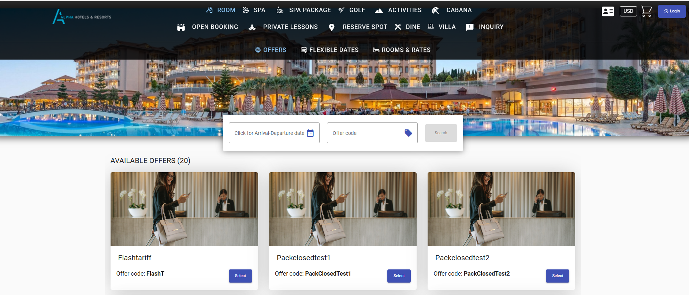

# Room Routes
-      /onecart/wbe/offers/1844/OmegaResorts
-      OmegaResorts - Property Id
-      1844 - Tenant Id

# Room Flow - Offers

1. The user clicks the **Room** product in the Book Application Navbar.
2. The Room product contains the following sub-pages:
   - Offers
   - Calendar
   - Rooms & Rates
3. By default, the user is navigated to the **Offers** page when the Room product is selected.
4. The Offers page displays a list of available offers in a card view, each with a **Select** button. A sticky filter bar is displayed at the top of the page to help users filter offers.
5. The filter bar contains:
   - Arrival Date
   - Departure Date
   - Offer Code
   - Guest Count Picker
   - Search Action (Button)
   - Clear Filter Action (Button)
6. When arrival and departure dates are selected, the system displays offers available for the selected date range.
7. Users can search for a specific offer using the **Offer Code** filter.
8. The **Guest Count Picker** allows users to specify the number of guests included in the offer search. This filter is displayed only when the property permission `displayGuestCountInOfferandCalendarPage` is enabled.
9. The search behavior depends on the `enableAutoSearch` permission:
   - If enabled, offers are automatically filtered when filter values change.
   - If disabled, users must click the **Search** button to apply the selected filters.
10. The **Clear Filter** action resets all filter values and reloads the default offer list.
11. When a user selects an offer, they are navigated to the **Calendar** page.

#### Image reference for common, but autosearch and guest count disabled due to permissions.

# Room Flow - Calendar

1. 